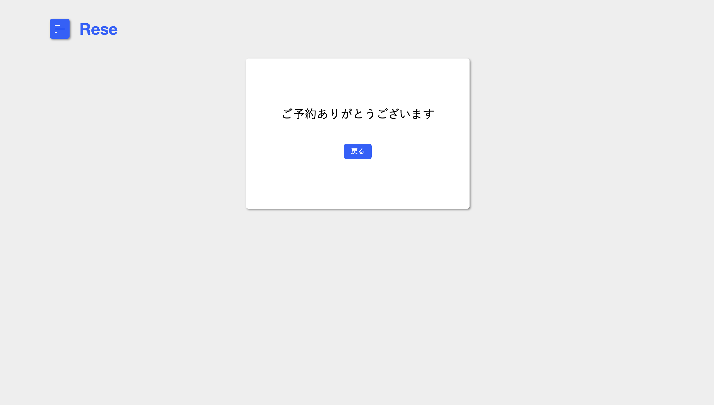

# rese(飲食店予約サービス)

ある企業グループ会社の飲食店予約サービス Rese です。  
競合他社のサイトは機能や画面が複雑で使いづらいという調査から、シンプルな設計で作成しました。

- 飲食店一覧ページ（メインページ）


各店舗の情報が一覧で表示され、「詳しくみる」のボタンから、各店舗の飲食店詳細ページに遷移します。  
検索機能については、エリア、ジャンル、店名での検索が可能です。  
また、ハートマークのボタンを押すことで、お気に入り登録・削除ができます。ここでお気に入りに追加した店舗は、マイページでお気に入り店舗一覧として表示されます。

- 飲食店詳細ページ


飲食店詳細ページでは、各店舗の詳細な情報を左側に表示させ、右側の予約フォームから、日付・時刻・人数を選択し、予約をすることが可能です。  
予約する際には認証必須となる為、ページ左上のアイコンを押すとウィンドウが開くようになっており、会員登録とログインができます。

- 予約完了ページ



飲食店詳細ページでの予約が完了したら、サンクスページが表示されます。  
「戻る」のボタンを押すと、飲食店詳細ページに戻ります。

- マイページ


マイページでは、画面上部にユーザー名が表示され、詳細ページから予約した予約情報一覧と、お気に入り店舗の一覧を見ることができます。

- menu1、menu2(モーダルウィンドウ)


menu1 と menu2 のウィンドウは、各ページの画面左上にあるアイコンをクリックすることで開くことが可能です。  
「会員登録」や「ログイン」がされていない場合には menu2 が表示され、Registration のリンクから「会員登録ページ」へ、Login のリンクから「ログインページ」へ遷移が出来ます。  
また、会員登録後に「ログイン済」の場合には menu1 が表示され、Home のリンクから「飲食店一覧ページ」へ、Logout のリンクからログアウトした上で「ログインページ」へ、Mypage のリンクから、「マイページ」に遷移できるようになっています。

- 会員登録ページ


- ログインページ


- サンクスページ


## 作成した目的

外部の飲食店サービスを利用すると手数料を取られる為、自社で予約サービスを持つことによるコスト削減を目的として作成。

## アプリケーション URL

- 開発環境：http://localhost/
- phpMyAdmin:：http://localhost:8080/

## 機能一覧

【基本実装】

- 会員登録機能
- ログイン機能
- ログアウト機能
- ユーザー情報取得機能
- ユーザー飲食店お気に入り一覧取得機能
- ユーザー飲食店予約情報取得機能
- 飲食店一覧取得機能
- 飲食店詳細取得機能
- 飲食店お気に入り追加機能
- 飲食店お気に入り削除機能
- 飲食店予約情報追加機能
- 飲食店予約情報削除機能
- エリア検索機能
- ジャンル検索機能
- 店名検索機能

【追加実装】

- 予約変更機能（予約日時と予約人数の変更）
- 評価機能（予約したお店の 5 段階評価とコメント）
- 管理画面
  (店舗代表者は店舗情報の作成と更新、予約の確認が可能。  
  管理者は店舗代表者の作成が可能。)
- メール認証による本人確認機能
- QR コード表示機能
- Stripe 決済機能

【Pro入会テスト】
- 口コミ機能（新規口コミ追加、口コミ編集、削除）
- 店舗一覧ソート機能
- csvインポート機能


## 使用技術（実行環境）

- PHP7.4.9
- Laravel8.83.27
- MySQL8.0.26
- Breeze1.10

## テーブル設計


## ER 図


## 環境構築

**Docker ビルド**

1. `git clone git@github.com:kngshi/sim_rese.git`
2. DockerDesktop アプリを立ち上げる
3. `docker-compose up -d --build`

> _Mac の M1・M2 チップの PC の場合、`no matching manifest for linux/arm64/v8 in the manifest list entries`のメッセージが表示されビルドができないことがあります。
> エラーが発生する場合は、docker-compose.yml ファイルの「mysql」内に「platform」の項目を追加で記載してください_

```bash
mysql:
    platform: linux/x86_64(この文を追加)
    image: mysql:8.0.26
    environment:
```

**Laravel 環境構築**

1. `docker-compose exec php bash`
2. `composer install`
3. 「.env.example」ファイルを 「.env」ファイルに命名を変更。または、新しく.env ファイルを作成
4. .env に以下の環境変数を追加

```text
DB_CONNECTION=mysql
DB_HOST=mysql
DB_PORT=3306
DB_DATABASE=laravel_db
DB_USERNAME=laravel_user
DB_PASSWORD=laravel_pass
```

5. アプリケーションキーの作成

```bash
php artisan key:generate
```

6. マイグレーションの実行

```bash
php artisan migrate
```

7. シーディングの実行

```bash
php artisan db:seed
```

> シーディングの際に、テストユーザーを登録しています。
> 管理者としてログインする際は、以下を使用をしてください。

```text
name: 管理者
email: admin@example.com
password: admin1234
```

> 店舗責任者としてログインする際は、以下を使用をしてください。

```text
name: 店舗責任者
email: manager@example.com
password: manager1234
```

> 一般ユーザーとしてログインする際は、以下のいずれかを使用をしてください。

```text
name: サンプルユーザー
email: sample@example.com
password: sample1234
```

```text
name: サンプルユーザー2
email: sample2@example.com
password: sample1234
```

> ※一般ユーザーの認証が必要なルートでは、メール認証が必要です。

**Laravel Breeze のインストール**

1. `composer require laravel/breeze --dev`
2. `php artisan breeze:install blade`
3. `php artisan migrate`
4. `npm install`
5. `npm run dev`

**csv ファイルの作成方法**

- 管理ユーザーは csv ファイル をインポートすることで、店舗情報を追加することができます。

- 以下のリンクからサンプルファイルにアクセスし、次のルールに従って csv ファイルを作成してください。  
  [csv ファイル サンプルをダウンロード](https://docs.google.com/spreadsheets/d/1O9Uter0i1GyjhzGjGGgyhbLD5uJnCOs4WMRQ2St0vrM/edit?usp=sharing)

```text
  ルール
- 各項目は全て入力必須です。
  セルに入力漏れがあると正常にインポートされないので、注意して下さい。
- 店舗名：50文字以内で入力。
- 地域：「東京都」「大阪府」「福岡県」のいずれかの文字を入力。
- ジャンル：「寿司」「焼肉」「イタリアン」「居酒屋」「ラーメン」のいずれかの文字を入力。
- 店舗概要：400文字以内で入力。
- 画像URL：画像のURLを入力。なお、ファイル形式はjpeg、pngのみアップロード可能です。

※１行目のセル内にある「店舗名,地域,ジャンル,店舗概要,画像 URL」などの文字は削除しないようにして下さい。
  (※これらの文字を削除した場合にも、エラーが発生します。)
  なお、「サンプル」のデータは、見本なので削除して構いません。
```

以上のルールに従って作成し、csv ファイルをインポートすることで、店舗情報の追加が出来ます。
