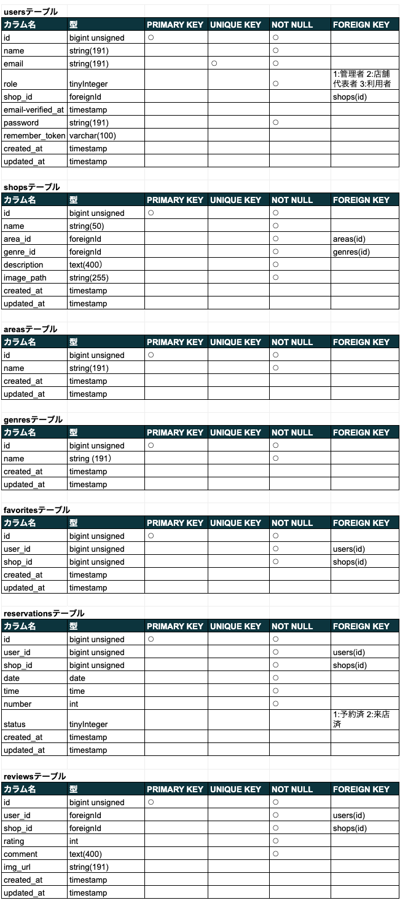
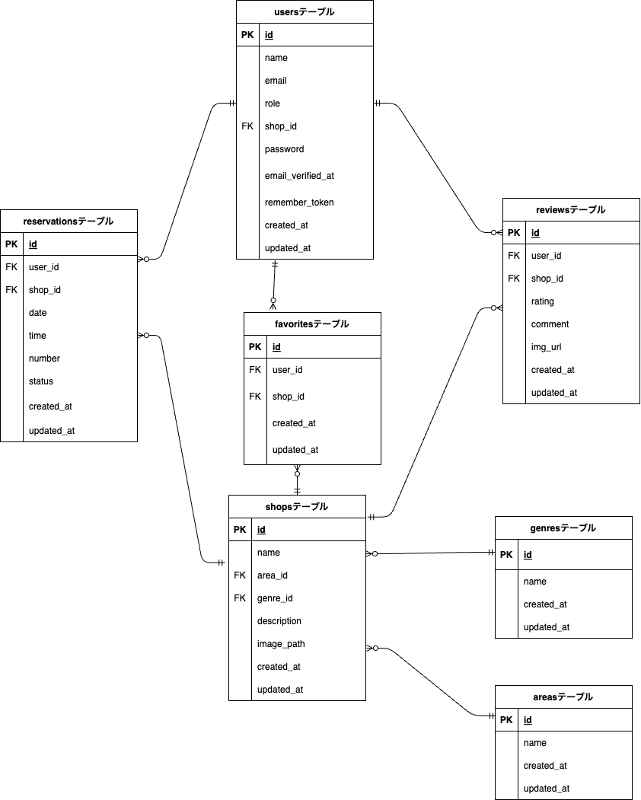

# rese(飲食店予約サービス)

- 飲食店一覧ページ（メインページ）


ある企業グループ会社の飲食店予約サービス Rese です。  
各店舗の情報が一覧で表示され、「詳しくみる」のボタンから、各店舗の飲食店詳細ページに遷移します。  
検索機能については、エリア、ジャンル、店名での検索が可能です。  
また、お気に入り登録・削除機能があり、ハートマークを押すと、マイページでお気に入り店舗の一覧として表示されるようになっています。

- 飲食店詳細ページ


飲食店詳細ページでは、各店舗の詳細な情報を左側に表示させ、右側の予約フォームから予約をすることが可能です。  
予約する際には認証必須となる為、ページ左上のアイコンを押すとウィンドウが開くようになっており、会員登録とログインができます。


マイページでは、画面上部にユーザー名が表示され、詳細ページから予約した予約情報一覧と、お気に入り店舗の一覧を見ることができます。

- menu1(モーダルウィンドウ 1)


menu1 と menu2 のウィンドウは、各ページの画面左上にあるアイコンをクリックすることで開くことが可能です。  
「会員登録」や「ログイン」がされていない場合には menu2 が表示され、Registration のリンクから「会員登録」が、Login のリンクから「ログイン」が出来るようになっています。  
会員登録後、「ログイン済」の場合には、menu1 が表示され、Home で飲食店一覧ページへ、Logout でログアウト、Mypage でマイページに遷移できるようになっています。

## 作成した目的

外部の飲食店サービスを利用すると手数料を取られる為、自社で予約サービスを持つことによるコスト削減を目的として作成。

## アプリケーション URL

- 開発環境：http://localhost/
- phpMyAdmin:：http://localhost:8080/

## 機能一覧

【基本実装】

- 会員登録機能
- ログイン機能
- ログアウト機能
- ユーザー情報取得機能
- ユーザー飲食店お気に入り一覧取得機能
- ユーザー飲食店予約情報取得機能
- 飲食店一覧取得機能
- 飲食店詳細取得機能
- 飲食店お気に入り追加機能
- 飲食店お気に入り削除機能
- 飲食店予約情報追加機能
- 飲食店予約情報削除機能
- エリア検索機能
- ジャンル検索機能
- 店名検索機能

【追加実装】

- 予約変更機能（予約日時、予約人数の変更）
- 評価機能（予約したお店の 5 段階評価とコメント）
- 管理画面（管理者と店舗代表者と利用者の３つの権限を作成。）  
  店舗代表者は店舗情報の作成と更新、予約の確認が可能。  
  管理者は店舗代表者の作成が可能。
- メール認証機能（メールによる本人確認）
- QR コード表示機能（予約情報を QR コードとして表示）
- 決済機能（Stripe を使った決済が可能）

## 使用技術（実行環境）

- PHP7.4.9
- Laravel8.83.27
- MySQL8.0.26
- Breeze1.10

## テーブル設計



## ER 図



## 環境構築

**Docker ビルド**

1. `git clone git@github.com:kngshi/sim_rese.git`
2. DockerDesktop アプリを立ち上げる
3. `docker-compose up -d --build`

> _Mac の M1・M2 チップの PC の場合、`no matching manifest for linux/arm64/v8 in the manifest list entries`のメッセージが表示されビルドができないことがあります。
> エラーが発生する場合は、docker-compose.yml ファイルの「mysql」内に「platform」の項目を追加で記載してください_

```bash
mysql:
    platform: linux/x86_64(この文を追加)
    image: mysql:8.0.26
    environment:
```

**Laravel 環境構築**

1. `docker-compose exec php bash`
2. `composer install`
3. 「.env.example」ファイルを 「.env」ファイルに命名を変更。または、新しく.env ファイルを作成
4. .env に以下の環境変数を追加

```text
DB_CONNECTION=mysql
DB_HOST=mysql
DB_PORT=3306
DB_DATABASE=laravel_db
DB_USERNAME=laravel_user
DB_PASSWORD=laravel_pass
```

5. アプリケーションキーの作成

```bash
php artisan key:generate
```

6. マイグレーションの実行

```bash
php artisan migrate
```

7. シーディングの実行

```bash
php artisan db:seed
```

**Laravel Breeze のインストール**

1. `composer require laravel/breeze --dev`
2. `php artisan breeze:install blade`
3. `php artisan migrate`
4. `npm install`
5. `npm run dev`

# sim_rese

# sim_rese
